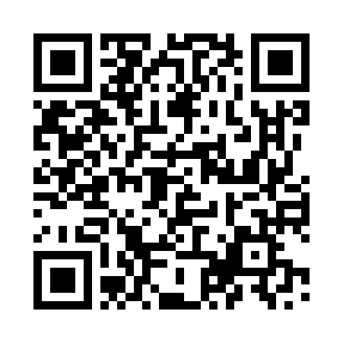

# Điện Biên — Xung phong

Game ôn tập học phần **Tư tưởng Hồ Chí Minh**: các tiểu đội thi phá cứ điểm bằng câu trả lời đúng.
Mỗi thành viên dùng điện thoại của mình; giảng viên mở phòng và chiếu mã, hoặc một nhóm tự chơi.

- **Vào chơi:** https://haianhhadang-collab.github.io/haidv.wargame/ — hoặc quét mã QR dưới đây.
  Nhập mã phòng 4 số (quét QR trên màn hình chiếu thì mã đã điền sẵn) và biệt danh (không cần tên thật).
- **Giới thiệu luật chơi:** [gioi-thieu.html](https://haianhhadang-collab.github.io/haidv.wargame/gioi-thieu.html).

## Nhanh! Nhanh! Nhanh! — phần thi Tăng tốc

Đua trên hành trình của Bác từ Nghệ An (1890) tới Quảng trường Ba Đình (2/9/1945): đội đấu đội
(mỗi người một máy, điểm đội = bình quân điểm các thành viên) hoặc cá nhân, thêm chế độ tự luyện.

- **Vào chơi:** https://haianhhadang-collab.github.io/haidv.wargame/nhanh/ — hoặc quét mã QR dưới đây.

Câu hỏi lấy từ Giáo trình Tư tưởng Hồ Chí Minh 2026. Dữ liệu trận đi qua máy chủ MQTT công cộng,
chỉ gồm biệt danh và lựa chọn trong game.

## Hành trình Tư tưởng — cờ đi theo lượt

Đường đua ô tổ ong ba màn: trên biển, cập bến Pác Bó, tiến về Thủ đô — Quảng trường Ba Đình; mỗi màn ba tuyến
(ngắn nhiều bẫy, dài ít bẫy) và một checkpoint. Trả lời đúng là xúc xắc 10 mặt tự lăn, người chơi tự chọn
đường; dọc đường có vật cản, cạm bẫy, bảo bối, hiếm hoi có Dịch chuyển tức thời. Ba cách chơi:
**một mình** (không cần mạng), **phòng** tối đa 10 người đua với nhau, và **đội đấu đội** cho cả lớp
(10 đội × 3 người, máy giảng viên giữ phòng và chiếu bản đồ). Màn 3 đi chung bản đồ và có thách đấu.

- **Vào chơi:** https://haianhhadang-collab.github.io/haidv.wargame/doi/ — hoặc quét mã QR dưới đây.

Câu hỏi lấy từ Giáo trình Tư tưởng Hồ Chí Minh 2026. Dữ liệu trận đi qua máy chủ MQTT công cộng,
chỉ gồm biệt danh và lựa chọn trong game.
