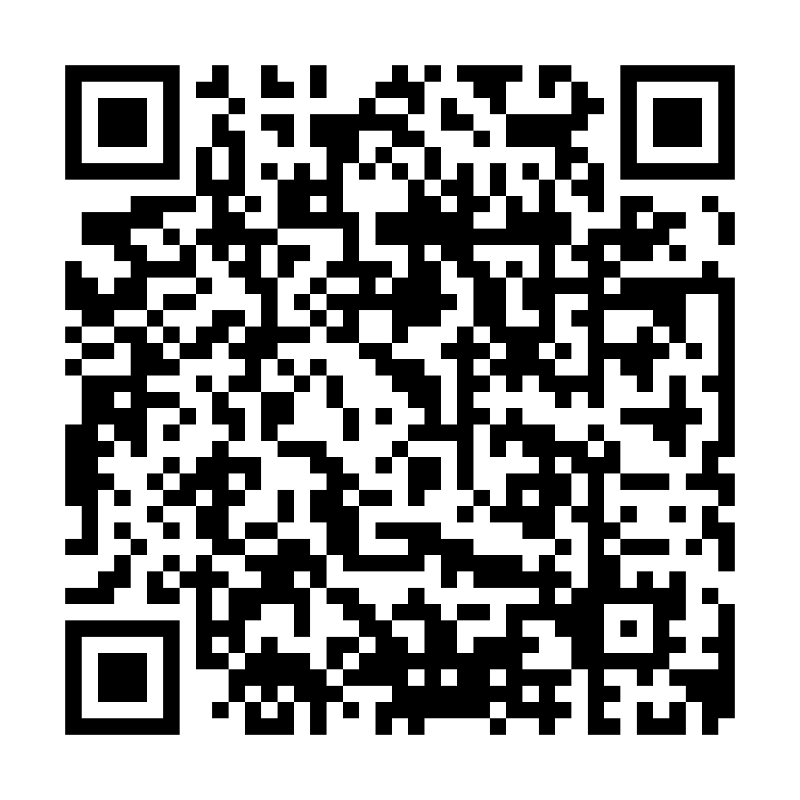
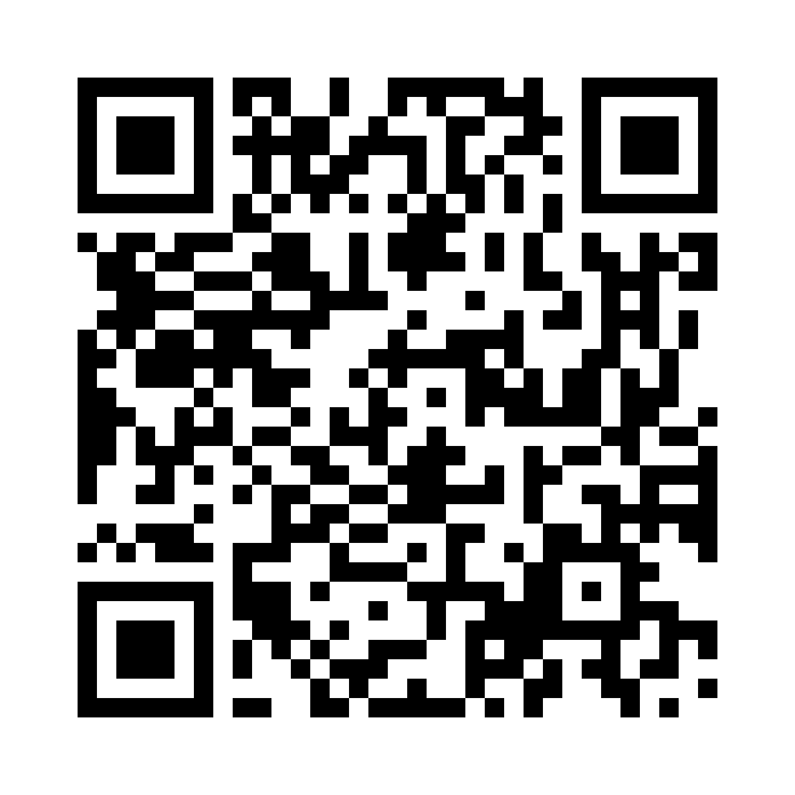

# Điện Biên — Xung phong

Game ôn tập học phần **Tư tưởng Hồ Chí Minh**: các tiểu đội thi phá cứ điểm bằng câu trả lời đúng.
Mỗi thành viên dùng điện thoại của mình; giảng viên mở phòng và chiếu mã, hoặc một nhóm tự chơi.

- **Vào chơi:** https://haianhhadang-collab.github.io/haidv.wargame/ — hoặc quét mã QR dưới đây.
  Nhập mã phòng 4 số (quét QR trên màn hình chiếu thì mã đã điền sẵn) và biệt danh (không cần tên thật).
- **Giới thiệu luật chơi:** [gioi-thieu.html](https://haianhhadang-collab.github.io/haidv.wargame/gioi-thieu.html).

## Nhanh! Nhanh! Nhanh! — phần thi Tăng tốc

Đua trên hành trình của Bác từ Nghệ An (1890) tới Quảng trường Ba Đình (2/9/1945): đội đấu đội
(mỗi người một máy, điểm đội = bình quân điểm các thành viên) hoặc cá nhân, thêm chế độ tự luyện.

- **Vào chơi:** https://haianhhadang-collab.github.io/haidv.wargame/nhanh/ — hoặc quét mã QR dưới đây.

Câu hỏi lấy từ Giáo trình Tư tưởng Hồ Chí Minh 2026. Dữ liệu trận đi qua máy chủ MQTT công cộng,
chỉ gồm biệt danh và lựa chọn trong game.
