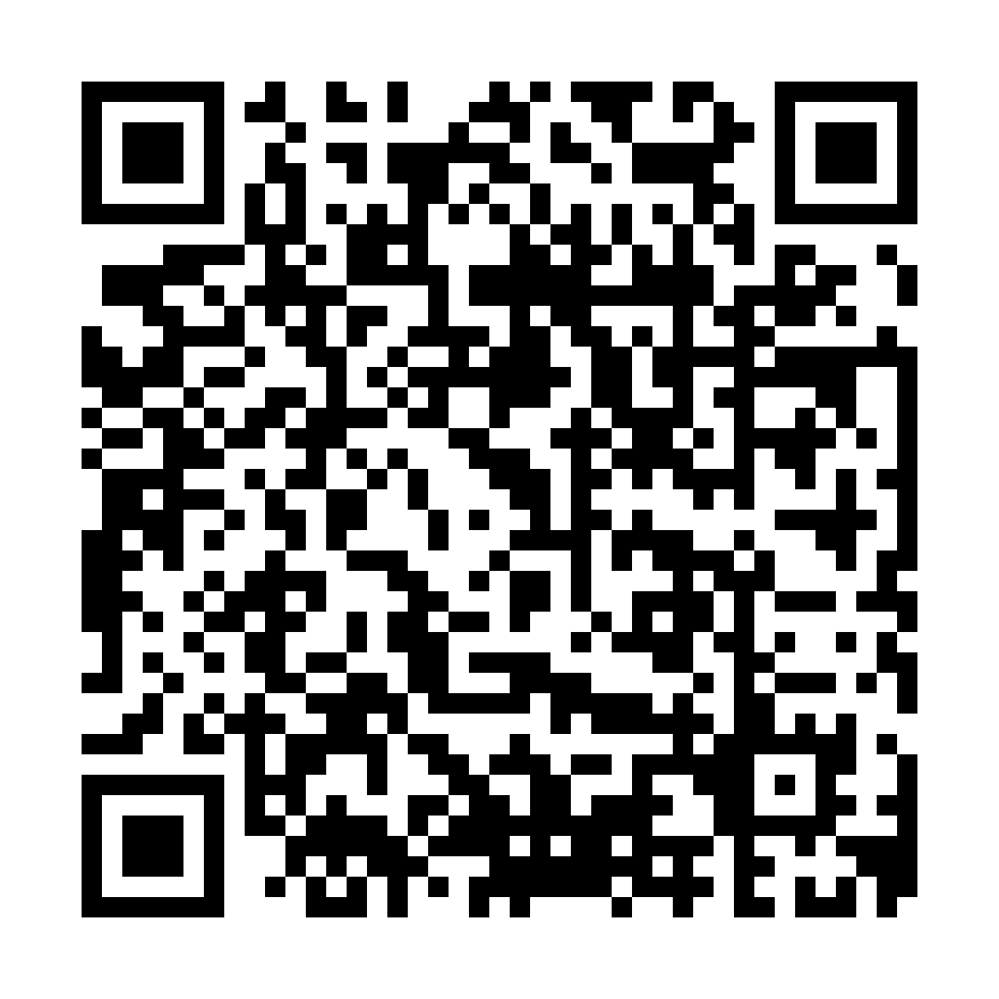
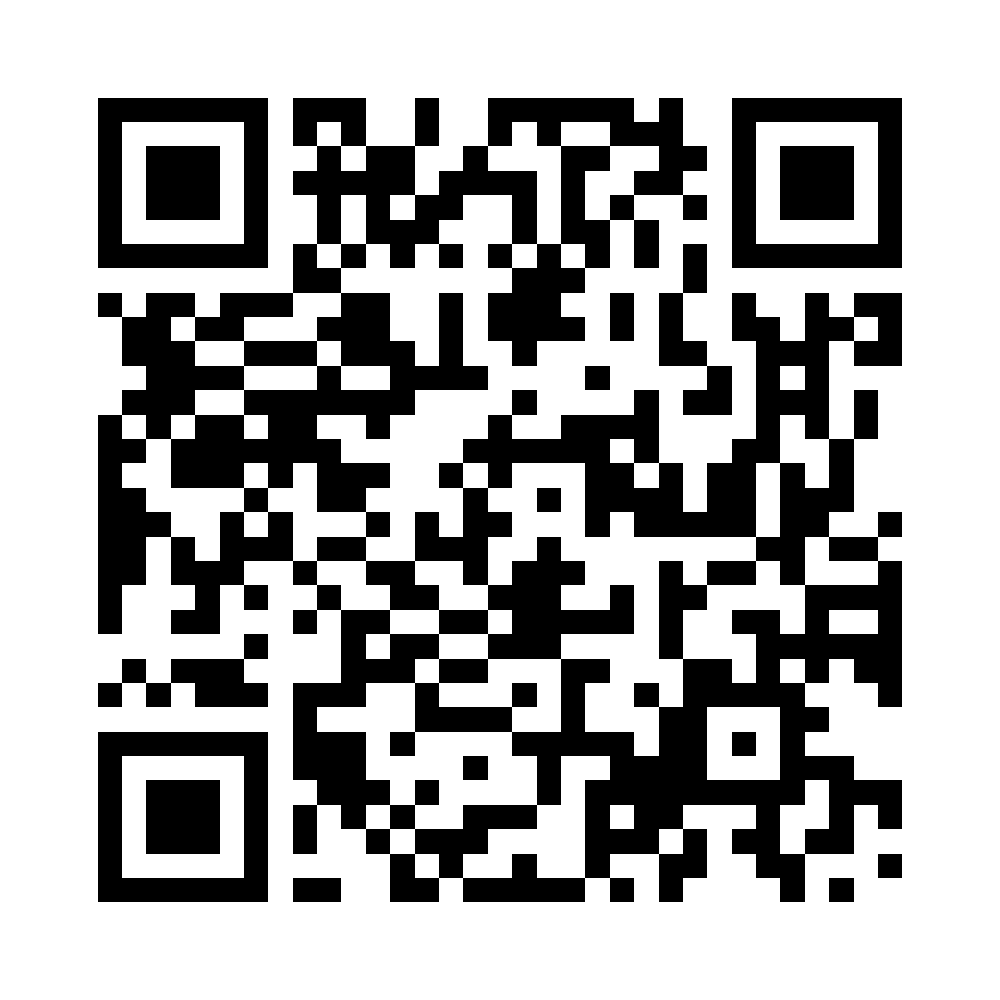
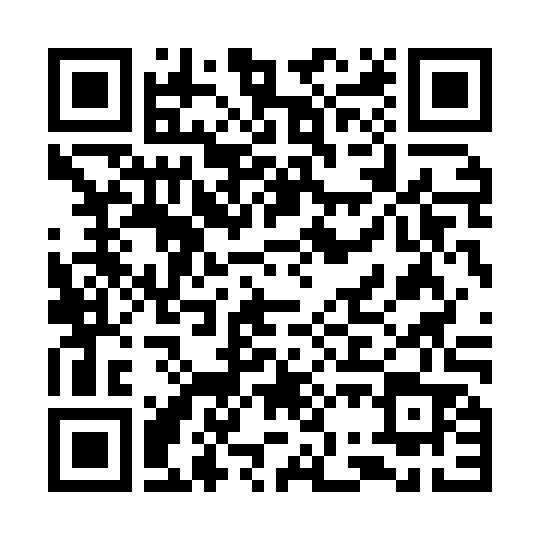
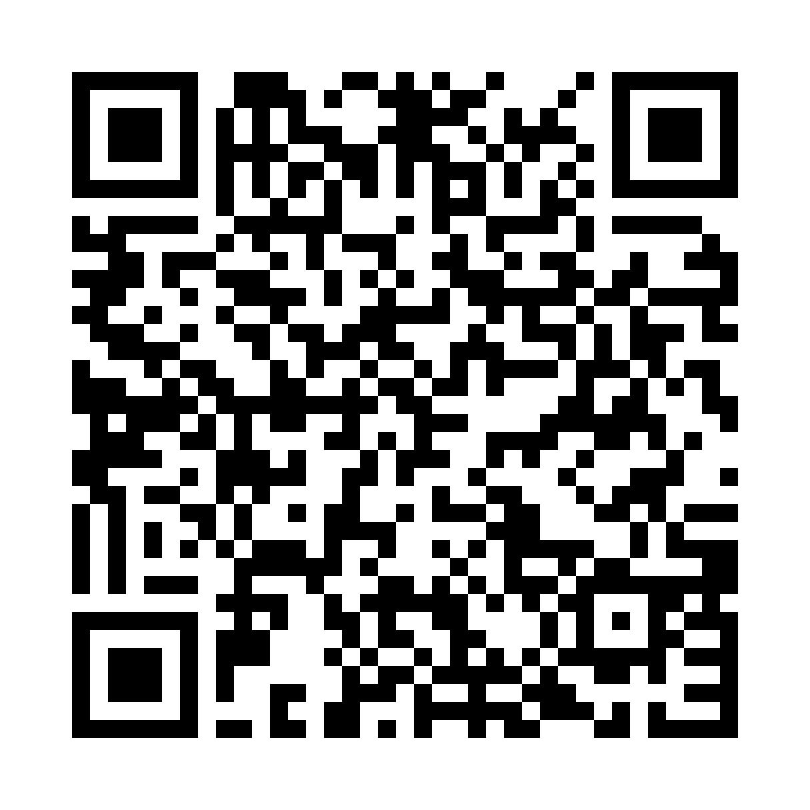
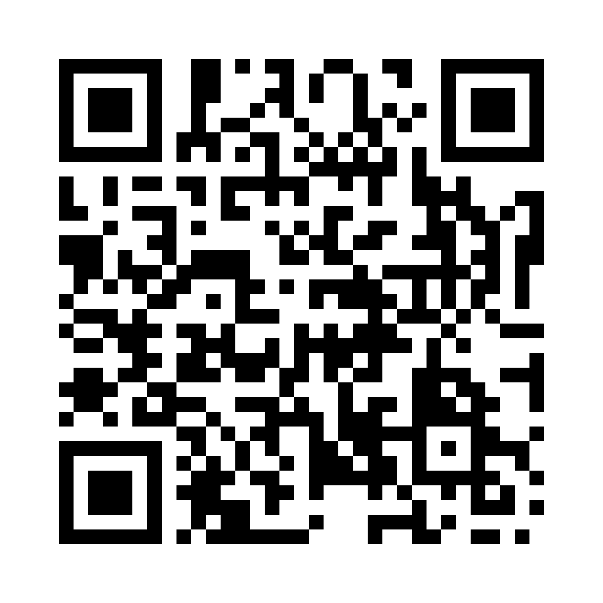
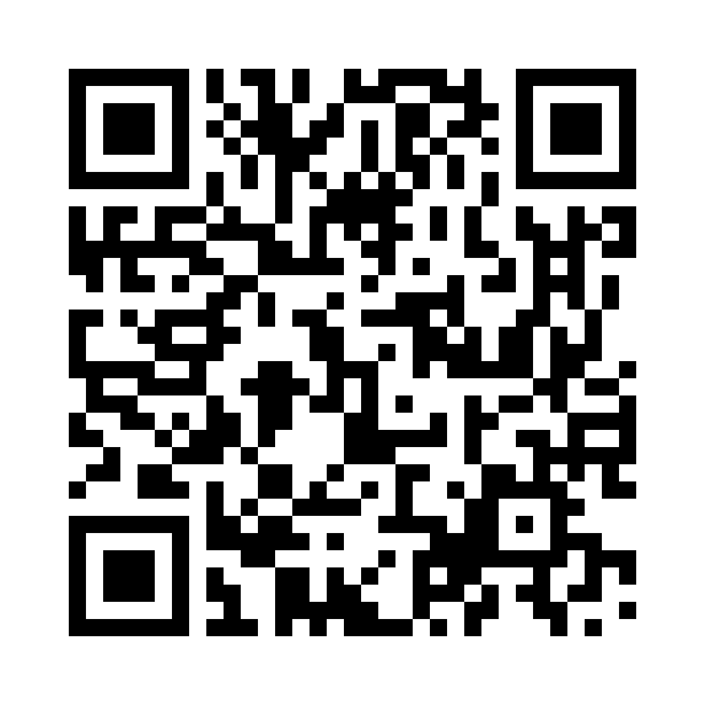

# Game học phần Tư tưởng Hồ Chí Minh

## Điện Biên — Xung phong

Các tiểu đội thi phá cứ điểm bằng câu trả lời đúng. Mỗi thành viên dùng điện thoại của mình;
giảng viên mở phòng và chiếu mã, hoặc một nhóm tự chơi.

Giới thiệu luật chơi: [gioi-thieu.html](https://haianhhadang-collab.github.io/haidv.wargame/gioi-thieu.html).

- **Vào chơi:** https://haianhhadang-collab.github.io/haidv.wargame/

Dữ liệu trận đi qua máy chủ MQTT công cộng, chỉ gồm biệt danh và lựa chọn trong game.

## Nhanh! Nhanh! Nhanh!

Phần thi Tăng tốc: đua trên hành trình của Bác từ Nghệ An (1890) tới Quảng trường Ba Đình (2/9/1945).
Đội đấu đội (mỗi người một máy, điểm đội = bình quân điểm các thành viên), cá nhân, hoặc tự luyện.

- **Vào chơi:** https://haianhhadang-collab.github.io/haidv.wargame/nhanh/

Dữ liệu trận đi qua máy chủ MQTT công cộng, chỉ gồm biệt danh và lựa chọn trong game.

## Hành trình Tư tưởng

Cờ đi theo lượt trên đường đua ô tổ ong ba màn: trên biển, cập bến Pác Bó, tiến về Thủ đô.
Mỗi màn ba tuyến (ngắn nhiều bẫy, dài ít bẫy) và một checkpoint; trả lời đúng là xúc xắc 10 mặt tự lăn.
Ba cách chơi: **một mình** (không cần mạng), **phòng** tối đa 10 người, **đội đấu đội** cho cả lớp
(10 đội × 3 người, máy giảng viên giữ phòng và chiếu bản đồ).

- **Vào chơi:** https://haianhhadang-collab.github.io/haidv.wargame/hanh-trinh-tu-tuong/

Dữ liệu trận đi qua máy chủ MQTT công cộng, chỉ gồm biệt danh và lựa chọn trong game.

## Đi tìm một nửa

Mỗi sinh viên giữ một mảnh câu Hồ Chí Minh trong Giáo trình 2026; đọc to, đi tìm người giữ mảnh còn lại
ở nhóm khác, nhập mã của nhau để ghép. Câu dài cắt ba mảnh, cần ba người phối hợp. Máy giảng viên giữ phòng và chiếu.

- **Vào chơi:** https://haianhhadang-collab.github.io/haidv.wargame/mot-nua/

Dữ liệu trận đi qua máy chủ MQTT công cộng, gồm số nhóm, họ tên người chơi nhập và lựa chọn trong game.

## Hải Trình Ba Mươi Năm

Tìm đường trên hải đồ hành trình 1911–1941, từ bến Nhà Rồng về Pác Bó: mỗi ngã rẽ một câu hỏi, bốn lối đi,
lối sai dẫn vào ngõ cụt — nơi Người từng ghé qua rồi đi tiếp. Ba cấp Dễ (15 ngã rẽ), Khó (30), Siêu khó (66, ba hải trình).
Ba chế độ: **Đội 2 người** (một máy, chia trái – phải), **Đội tự do** (mỗi người một máy, cùng vào một phòng bằng mã
4 chữ số, đua song song), **Ôn tập** (không tính giờ).

- **Vào chơi:** https://haianhhadang-collab.github.io/haidv.wargame/hai-trinh-30-nam/

Chế độ Đội tự do gửi dữ liệu trận qua máy chủ MQTT công cộng, gồm tên người chơi nhập, vị trí tàu và điểm; hai chế độ còn lại không dùng mạng.

## 1911 — Anh Ba xin làm phụ bếp

Game nhập vai cá nhân trên điện thoại, khoảng 15 phút: vào vai anh Ba xin làm phụ bếp trên con tàu
rời bến Nhà Rồng ngày 5/6/1911. Qua bếp trưởng, viên trung úy cầm hồ sơ và thuyền trưởng bằng logic,
óc phán đoán và kiến thức giáo trình (thời kỳ trước năm 1911). Không cần mạng sau khi mở trang.

- **Vào chơi:** https://haianhhadang-collab.github.io/haidv.wargame/1911/

## Lúc đó Bác tên gì?

Game mini cá nhân, mỗi em một điện thoại: 10 câu về các tên gọi của Bác qua từng chặng đường,
10 giây một câu, chấm theo **đúng** và **nhanh**. Tên người chơi ghi `Số nhóm _ Họ tên` để màn
thống kê của giảng viên gộp được điểm theo nhóm. Khoảng 6 phút.

- **Vào chơi:** https://haianhhadang-collab.github.io/haidv.wargame/ten-goi/

## Đấu trường (buổi 2)

**Bản của giảng viên, chiếu lên bảng** — không phải game sinh viên tự chơi. Mỗi nhóm cử một đại diện
giơ tay, 15 giây một câu, đúng +2 sai −1, máy tự cộng điểm bốn nhóm. Chạy trên một máy, không cần mạng.

- **Mở trên máy chiếu:** https://haianhhadang-collab.github.io/haidv.wargame/dau-truong/

## Bẫy chéo (buổi 3, bản dự phòng)

**Bản của giảng viên, chiếu lên bảng**, chỉ mở khi lớp nộp thiếu câu hỏi tự soạn: 12 câu vòng chính
(đúng +3, sai −1) và 3 câu vòng đặc biệt về thang điểm. Chạy trên một máy, không cần mạng.

- **Mở trên máy chiếu:** https://haianhhadang-collab.github.io/haidv.wargame/bay-cheo/

## Chạy tiếp sức bốn vế

**Bản của giảng viên, chiếu lên bảng** — bản điện tử của trò tổng kết cuối buổi 2: sáu ô chữ,
bốn ô đúng và hai ô sai; mỗi nhóm cử 4 bạn chạy lên bảng viết số vế mình phụ trách, máy giữ thứ tự
về đích và chấm. Chạy trên một máy nối máy chiếu, không cần mạng.

- **Mở trên máy chiếu:** https://haianhhadang-collab.github.io/haidv.wargame/tiep-suc/

---

Câu hỏi và trích dẫn lấy từ **Giáo trình Tư tưởng Hồ Chí Minh 2026**.
Kho này chỉ chứa học liệu phát cho sinh viên — không có đề thi, bản giáo trình hay danh sách lớp.
